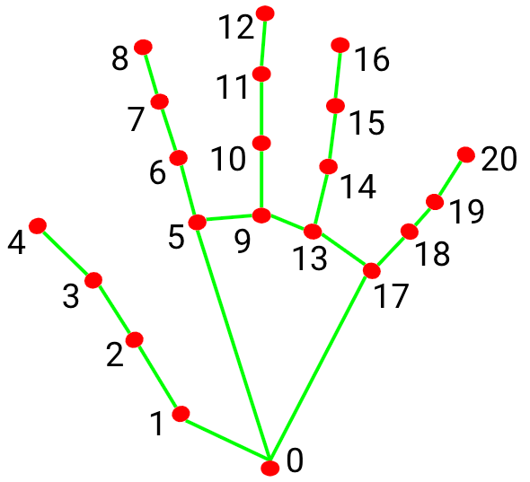

# 🤚 Hand Gesture Classification Using MediaPipe Landmarks

[](https://www.python.org/)
[](https://scikit-learn.org/)
[](https://mediapipe.dev/)
[](LICENSE)

A machine learning pipeline for **real-time hand gesture classification** using MediaPipe hand landmarks extracted from the [HaGRID dataset](https://github.com/hukenovs/hagrid). Three models (KNN, SVM, Random Forest) are trained, evaluated, and deployed on video with prediction stabilization.



---

## 📋 Table of Contents

- [Overview](#overview)
- [Dataset](#dataset)
- [Project Structure](#project-structure)
- [Installation](#installation)
- [Usage](#usage)
- [Model Performance](#model-performance)
- [Video Inference](#video-inference)
---

## Overview

This project classifies **18 hand gestures** from 21 MediaPipe hand landmarks (63 features: x, y, z per landmark). The pipeline includes:

1. **Data preprocessing** — Translation- and scale-invariant normalization
2. **Model training** — KNN, SVM, and Random Forest with GridSearchCV
3. **Evaluation** — Accuracy, precision, recall, F1-score comparison
4. **Video inference** — Per-model annotated videos with mode-based stabilization

---

## Dataset

The dataset is derived from the **HaGRID (HAnd Gesture Recognition Image Dataset)** with MediaPipe-extracted landmarks.

| Property | Value |
|----------|-------|
| **Samples** | 25,675 |
| **Features** | 63 (21 landmarks × 3 coordinates) |
| **Classes** | 18 gesture types |
| **Format** | CSV (`hand_landmarks_data.csv`) |

### Gesture Classes

`call` · `dislike` · `fist` · `four` · `like` · `mute` · `ok` · `one` · `palm` · `peace` · `peace_inverted` · `rock` · `stop` · `stop_inverted` · `three` · `three2` · `two_up` · `two_up_inverted`

---

## Project Structure

```
├── Hand-Gesture-Classification.ipynb   # Main notebook (training + evaluation)
├── process_video.py                    # Video inference script (per-model)
├── utility.py                          # Shared normalization functions
├── hand_landmarks_data.csv             # Raw landmark dataset
├── hand_landmarks.png                  # Landmark diagram
├── models/
│   ├── knn_best_model.joblib           # Trained KNN model
│   ├── svm_best_model.joblib           # Trained SVM model
│   ├── random_forest_best_model.joblib # Trained Random Forest model
│   └── hand_landmarker.task            # MediaPipe hand landmarker model
├── videos/
│   ├── input/                          # Input test videos
│   └── output/                         # Annotated output videos (per model)
└── .gitignore
```

---

## Installation

### Prerequisites

- Python 3.13+
- [MediaPipe](https://mediapipe.dev/) hand landmarker model
- [ffmpeg](https://ffmpeg.org/) (for browser-compatible video encoding)

### Setup

```bash
# Clone the repository
git clone https://github.com/AbdelazizAhmed1811/Hand-Gesture-Classification-Using-MediaPipe-Landmarks-from-the-HaGRID-Dataset.git
cd Hand-Gesture-Classification-Using-MediaPipe-Landmarks-from-the-HaGRID-Dataset

# Create virtual environment
python3.13 -m venv hand_gesture
source hand_gesture/bin/activate

# Install dependencies
pip install numpy scipy scikit-learn mediapipe opencv-python joblib matplotlib seaborn pandas
```

---

## Usage

### Training & Evaluation

Open and run the Jupyter notebook:

```bash
jupyter notebook Hand-Gesture-Classification.ipynb
```

The notebook covers:
1. Data loading and exploration
2. Landmark normalization
3. Model training with cross-validation
4. Evaluation metrics and confusion matrices
5. Conclusion and model recommendation

### Video Inference

Process input videos with all trained models:

```bash
# Activate the virtual environment
source hand_gesture/bin/activate

# Run video processing (generates one output per model)
python process_video.py
```

This produces browser-compatible MP4 videos in `videos/output/` with stabilized gesture predictions.

---

## Model Performance

| Model | Accuracy | Precision | Recall | F1-Score |
|-------|----------|-----------|--------|----------|
| KNN | 97.74% | 97.73% | 97.73% | 97.72% |
| SVM | 97.82% | 97.81% | 97.82% | 97.80% |
| **Random Forest** | **97.88%** | **97.84%** | **97.85%** | **97.84%** |

> All metrics are macro-averaged across 18 classes.

## Video Inference

Predictions are **stabilized** using a rolling-window mode filter (15 frames), eliminating per-frame flickering. Output videos use H.264 encoding for browser compatibility.

Each model generates its own output video:
- `output_rf.mp4`

---

## Author

**Abdelaziz Ahmed**

---
